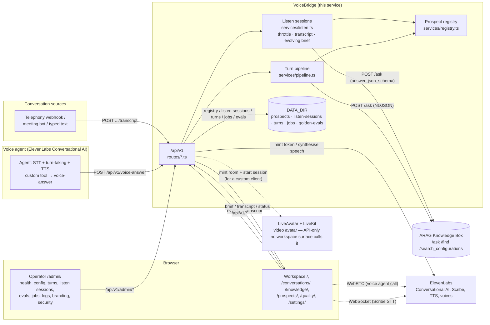
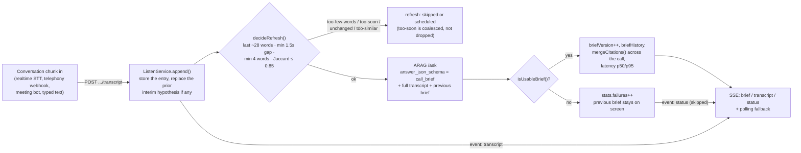
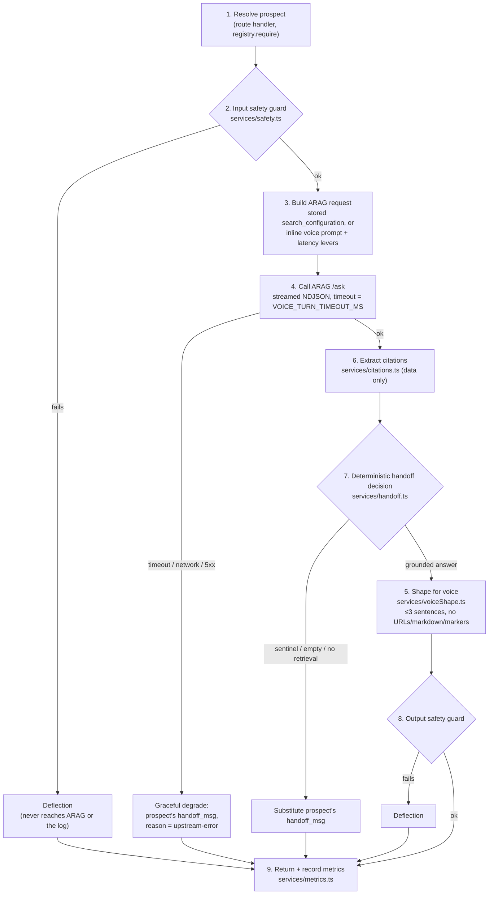

# Architecture

VoiceBridge's hero capability is **real-time listening**: a session ingests a live conversation as
it happens, from any source, and streams back an evolving, grounded, cited brief while the
conversation is still going (`DECISIONS.md` D-20). Self-serve voice deflection — a voice agent
asking one question and getting one spoken answer — is the follow-on surface, built on the same
ARAG integration. In both cases the voice platform (or the telephony/meeting-bot source) owns the
audio; ARAG owns the answer; VoiceBridge is the service that turns one into the other safely —
grounding every word, deciding deterministically when to hand off to a human, and shaping the
result for its surface (speakable for a turn, structured for a brief).

## Surfaces

Both browser surfaces consume **only** `/api/v1` (Operator additionally uses `/api/v1/admin/*`, and
the workspace's own `/prospects/` view calls the same admin routes once unlocked with the admin
token) — neither one is trusted with ARAG or ElevenLabs credentials. A voice agent's custom tool, a
telephony webhook, a meeting bot, and the workspace's own typed/pasted/sample conversation are all
independent, symmetric callers of the same session and turn endpoints; from VoiceBridge's point of
view a phone call being transcribed into a session and a line pasted into Live are the identical
request shape.

## Real-time listening

A session (`ListenService`, `src/services/listen.ts`) is the state a voice turn deliberately does
not have: it owns the rolling transcript, the throttle's per-session bookkeeping (`lastNorm`,
`lastFireAt` — never exposed through the API), the one evolving brief (refined, not restarted, each
call), citations accumulated across the whole call, and per-refresh latency stats. The throttle
lives on the server rather than in a browser specifically so every client — Live, a
telephony bridge, a softphone plugin — gets the same behaviour and the same cost profile, and a
naive or chatty client cannot turn every word into an LLM call. A refresh itself is the same
`runBrief()` primitive `POST /api/v1/brief` exposes statelessly (see
[`arag-integration.md`](arag-integration.md) for the exact `answer_json_schema`); a session is that
primitive plus the bookkeeping needed to call it well over the course of a call.

## The turn pipeline

Every voice turn — live, from Knowledge's "ask it something" tester, or from a golden-set run — takes the same nine ordered
steps in `src/services/pipeline.ts::runTurn()`. Every failure path resolves to a spoken handoff line
rather than throwing, so the caller never gets dead air.

The numbering in the diagram matches the numbered comments in `runTurn()` itself; step 5 (voice
shaping) only runs on the grounded-answer path, and step 6 (citation extraction) runs before the
handoff decision because citations still get logged even on a handoff. Steps 2 and 8 are the input
and output safety guards — see [`security-model.md`](security-model.md) for what they do and do not
catch, and [`../developer/extension-points.md`](../developer/extension-points.md) for where a real
moderation classifier would replace them.

`GoldenEval` builds directly on this: `runGoldenEval()` (`src/services/goldenEval.ts`) calls
`runTurn()` directly with `history: []` for every golden question, so a golden-set pass is a
guarantee about the exact code path the live agent uses, not a separate check. `runBrief()`
(`src/services/brief.ts`) is a sibling pipeline used by both the stateless `POST /api/v1/brief`
primitive and, on every listen-session refresh, by `ListenService` above — same input guard, same
ARAG client, but a structured `answer_json_schema` response instead of a spoken line (see
[`arag-integration.md`](arag-integration.md)).

## Why this shape

The turn pipeline is a **cascade** voice pipeline, not a speech-to-speech model: the voice platform
handles STT/turn-taking/TTS as text in and text out, and VoiceBridge's job is entirely in that text
layer. For knowledge-grounded enterprise voice this is the practical choice — it keeps reasoning on
text with full tool control and puts ARAG in the reasoning slot, rather than spending an
audio-native model's context budget on audio tokens. A single voice turn is stateless: ARAG's
`/ask` is stateless per call, so every turn carries its own bounded conversation history
(`MAX_HISTORY_TURNS`) rather than the bridge holding session state. Real-time listening is the
deliberate exception to that: a session exists precisely because an evolving brief needs somewhere
to evolve, so `ListenService` holds bounded, capped state (transcript, brief history, citations,
throttle bookkeeping) for the lifetime of a call and no longer — see
[`data-flow.md`](data-flow.md) for exactly what that state is and where it lives.

## Architecture decisions

**D-20** in the workspace-wide [`DECISIONS.md`](../../../DECISIONS.md) sets the product's centre of
gravity: real-time listening (agent-assist) is the hero feature — a headless session API
independent of any one STT vendor — with self-serve voice deflection as the follow-on, not the
other way around. **V-14** in this repository's own [`DECISIONS.md`](../../DECISIONS.md) is the
technical decision that follows from it: listening is a **server-side session**, not a browser
loop — `ListenService` owns the rolling transcript, the throttle, the evolving brief, the
accumulated citations and the latency stats, so the cost profile is a property of the product
rather than something every client reimplements differently (and, per V-16, the demo's own hero
path is that same session API driven by a scripted sample conversation, not a recorded animation).
Everything in this document and in [`data-flow.md`](data-flow.md), [`scaling.md`](scaling.md),
[`security-model.md`](security-model.md) and [`limits.md`](limits.md) that treats listening as
primary is downstream of these decisions.

The product-level decisions made when this prototype was rebuilt on the shared ARAG platform are
recorded in full, with dates and consequences, in this repository's own
[`DECISIONS.md`](../../DECISIONS.md) (V-01…V-17) — worth reading directly rather than summarised,
since each one explains a trade-off a reviewer is likely to ask about (the `/v1` compatibility
alias, the registry moving off a committed file, per-prospect ARAG clients sharing one token, the
handoff sentinel contract, per-route rate limits now owned by the platform, mandatory auth on
credential-minting routes, the text-turn-tester-first demo, guard-trip redaction in the turn log,
the vendored ElevenLabs client, golden evals as in-process jobs, the separate voice-turn timeout,
listening as a server-side session, and the sample-conversation demo path).

Three earlier decisions predate that rewrite and still hold — they are why the system looks like a
webhook over `/ask` rather than an MCP integration, and why ARAG is in the loop at all:

- **Cascade, not speech-to-speech.** STT → retrieval/generation → TTS as three separable stages,
  reasoning on text throughout. This is what lets ARAG sit in the reasoning slot and what lets the
  turn pipeline above be unit-tested with an injected ARAG stub instead of audio fixtures.
- **A webhook over ARAG's `/ask`, not ARAG's MCP server.** ARAG's MCP server exposes retrieval only
  (`search_documents`, `get_document`, `batch_get_documents`); binding a voice agent to it would
  make the *agent's own* LLM compose the answer from raw retrieval, discarding ARAG's composed,
  cited, governed answer, its multi-model routing and its citation formatting — i.e. reducing ARAG
  to a vector lookup. Calling `/ask` from a small server-side webhook (this service) is the extra
  cost that keeps the governed answer.
- **Why ARAG and not the voice platform's own built-in knowledge base.** A native/built-in KB is
  adequate for an FAQ bot; it is not label/security-filtered retrieval, cross-encoder reranking, or
  audit-grade citations. If a demo of this system doesn't surface citations, grounding and a clean
  handoff, it is functionally demoing a free feature of the voice platform and the case for ARAG
  is lost. This is why citations are a first-class field in `VoiceAnswerResponse` rather than an
  afterthought, and why `security.groups` — despite being a filter convenience rather than a hard
  authorisation boundary, see [`security-model.md`](security-model.md) — is exercised and shown
  rather than silently omitted.

## Where to go next

- [`arag-integration.md`](arag-integration.md) — the exact `/ask` request/response shapes, the
  brief's `answer_json_schema`, and why citations and `answer_json_schema` cannot both be set.
- [`data-flow.md`](data-flow.md) — what happens, and what gets persisted, for a listen session, a
  voice turn, a stateless brief call and a golden-eval run.
- [`security-model.md`](security-model.md), [`scaling.md`](scaling.md), [`limits.md`](limits.md) —
  the threat model, the capacity picture, and an honest list of what is not production-hardened yet.
