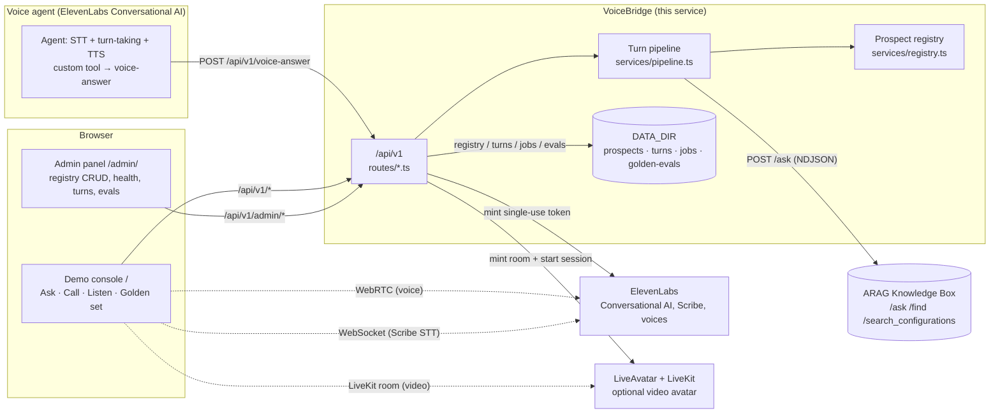
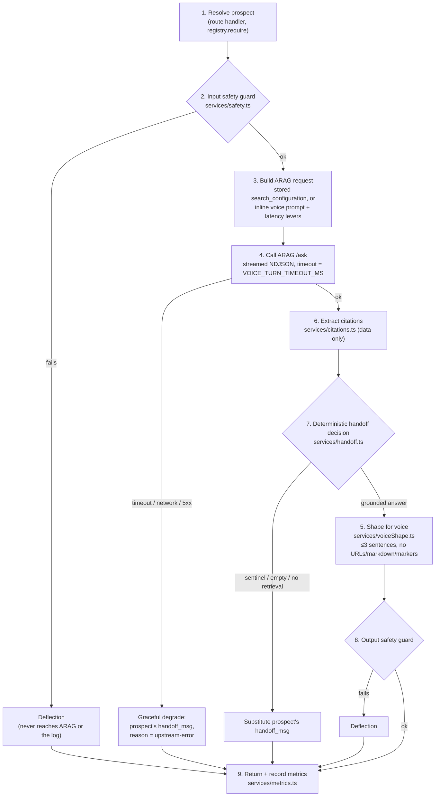

# Architecture

VoiceBridge sits between a voice agent's transport (speech-to-text, turn-taking, text-to-speech)
and Progress Agentic RAG's retrieval-and-answer layer. The voice platform owns the call; ARAG owns
the answer; VoiceBridge is the thin, stateless service that turns one into the other safely —
grounding every spoken word, deciding deterministically when to hand off to a human, and shaping
the result so it is actually speakable.

## Surfaces

Both browser surfaces consume **only** `/api/v1` (the admin panel additionally uses
`/api/v1/admin/*`) — neither one is trusted with ARAG or ElevenLabs credentials. The voice agent's
custom tool is a third, independent client of the same `/api/v1/voice-answer` endpoint; from
VoiceBridge's point of view a phone call and a typed question in the Ask tab are the identical
request.

## The turn pipeline

Every voice turn — live, from the Ask tab, or from a golden-set run — takes the same nine ordered
steps in `src/services/pipeline.ts::runTurn()`. Every failure path resolves to a spoken handoff line
rather than throwing, so the caller never gets dead air.

The numbering in the diagram matches the numbered comments in `runTurn()` itself; step 5 (voice
shaping) only runs on the grounded-answer path, and step 6 (citation extraction) runs before the
handoff decision because citations still get logged even on a handoff. Steps 2 and 8 are the input
and output safety guards — see [`security-model.md`](security-model.md) for what they do and do not
catch, and [`../developer/extension-points.md`](../developer/extension-points.md) for where a real
moderation classifier would replace them.

`GoldenEval` and the `/api/v1/brief` route both build on this: `runGoldenEval()`
(`src/services/goldenEval.ts`) calls `runTurn()` directly with `history: []` for every golden
question, so a golden-set pass is a guarantee about the exact code path the live agent uses, not a
separate check. `runBrief()` (`src/services/brief.ts`) is a sibling pipeline for the ambient Listen
mode — same input guard, same ARAG client, but a structured `answer_json_schema` response instead
of a spoken line (see [`arag-integration.md`](arag-integration.md)).

## Why this shape

The system is a **cascade** voice pipeline, not a speech-to-speech model: the voice platform
handles STT/turn-taking/TTS as text in and text out, and VoiceBridge's job is entirely in that text
layer. For knowledge-grounded enterprise voice this is the practical choice — it keeps reasoning on
text with full tool control and puts ARAG in the reasoning slot, rather than spending an
audio-native model's context budget on audio tokens. VoiceBridge itself is stateless: ARAG's `/ask`
is stateless per call, so every turn carries its own bounded conversation history
(`MAX_HISTORY_TURNS`) rather than the bridge holding session state.

## Architecture decisions

The product-level decisions made when this prototype was rebuilt on the shared ARAG platform are
recorded in full, with dates and consequences, in [`../../DECISIONS.md`](../../DECISIONS.md)
(V-01…V-11) — worth reading directly rather than summarised, since each one explains a trade-off a
reviewer is likely to ask about (the `/v1` compatibility alias, the registry moving off a committed
file, per-prospect ARAG clients sharing one token, the handoff sentinel contract, per-route rate
limits, mandatory auth on credential-minting routes, the text-turn-tester-first demo, guard-trip
redaction in the turn log, the vendored ElevenLabs client, golden evals as in-process jobs, and the
separate voice-turn timeout).

Three earlier decisions predate that rewrite and still hold — they are why the system looks like a
webhook over `/ask` rather than an MCP integration, and why ARAG is in the loop at all:

- **Cascade, not speech-to-speech.** STT → retrieval/generation → TTS as three separable stages,
  reasoning on text throughout. This is what lets ARAG sit in the reasoning slot and what lets the
  turn pipeline above be unit-tested with an injected ARAG stub instead of audio fixtures.
- **A webhook over ARAG's `/ask`, not ARAG's MCP server.** ARAG's MCP server exposes retrieval only
  (`search_documents`, `get_document`, `batch_get_documents`); binding a voice agent to it would
  make the *agent's own* LLM compose the answer from raw retrieval, discarding ARAG's composed,
  cited, governed answer, its multi-model routing and its citation formatting — i.e. reducing ARAG
  to a vector lookup. Calling `/ask` from a small server-side webhook (this service) is the extra
  cost that keeps the governed answer.
- **Why ARAG and not the voice platform's own built-in knowledge base.** A native/built-in KB is
  adequate for an FAQ bot; it is not label/security-filtered retrieval, cross-encoder reranking, or
  audit-grade citations. If a demo of this system doesn't surface citations, grounding and a clean
  handoff, it is functionally demoing a free feature of the voice platform and the case for ARAG
  is lost. This is why citations are a first-class field in `VoiceAnswerResponse` rather than an
  afterthought, and why `security.groups` — despite being a filter convenience rather than a hard
  authorisation boundary, see [`security-model.md`](security-model.md) — is exercised and shown
  rather than silently omitted.

## Where to go next

- [`arag-integration.md`](arag-integration.md) — the exact `/ask` request/response shapes, the
  brief's `answer_json_schema`, and why citations and `answer_json_schema` cannot both be set.
- [`data-flow.md`](data-flow.md) — what happens, and what gets persisted, for a turn, a brief
  refresh and a golden-eval run.
- [`security-model.md`](security-model.md), [`scaling.md`](scaling.md), [`limits.md`](limits.md) —
  the threat model, the capacity picture, and an honest list of what is not production-hardened yet.
