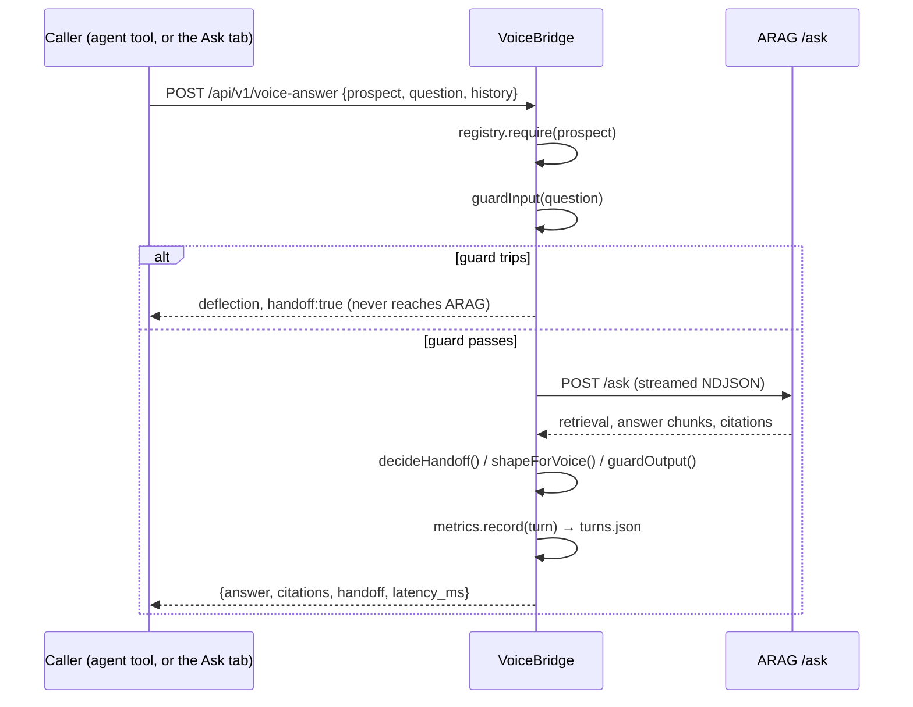
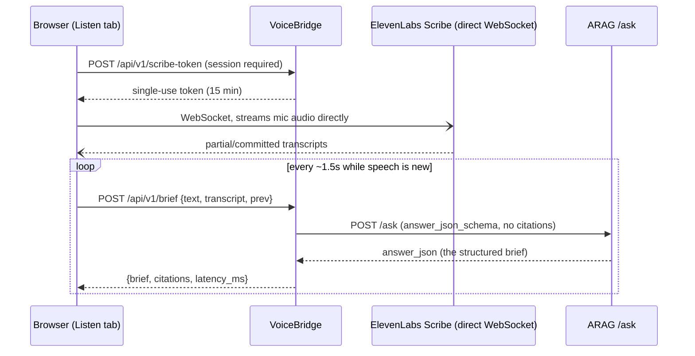
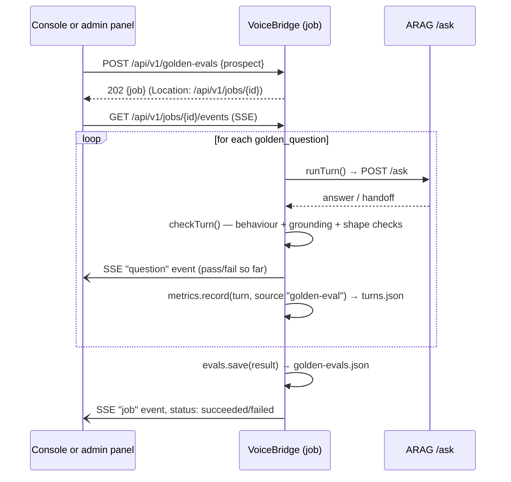

# Data flow

## What is persisted where

Everything VoiceBridge persists lives under `DATA_DIR` (default `./data`, `/data` in the Docker
image and on the Fly volume) as one JSON file per collection, managed by the platform's
`Store`/`Collection` (`vendor/arag-platform/src/store/jsonstore.ts`): an in-memory `Map` backed by
whole-file writes, debounced 50 ms and made atomic with a temp-file rename. There is no database —
see [`../developer/extension-points.md`](../developer/extension-points.md) for how a different
store would slot in behind the same `Collection<T>` interface, and [`scaling.md`](scaling.md) for
when this stops being enough.

| File | Collection | Written by | Read by |
|---|---|---|---|
| `prospects.json` | registry entries | `ProspectRegistry` (`src/services/registry.ts`) — seeded once from `config/prospects.example.json` on first boot if empty, then admin CRUD | every route that resolves a prospect; the console's prospect selector (via the non-secret projection) |
| `turns.json` | recent turn log, capped ring (`VOICE_TURN_LOG_LIMIT`, default 500) | `MetricsService.record()` (`src/services/metrics.ts`), called from both the voice-answer route and golden-eval runs | `GET /api/v1/metrics` (aggregated), `GET /api/v1/admin/turns` (raw rows) |
| `jobs.json` | async job records + their event log | `JobManager` (platform, `vendor/arag-platform/src/store/jobs.ts`) | `GET /api/v1/jobs`, `GET /api/v1/jobs/{id}`, the job-events SSE stream |
| `golden-evals.json` | golden-eval results, capped at 50 | `GoldenEvalStore.save()` (`src/services/goldenEval.ts`), called when a golden-eval job finishes | `GET /api/v1/golden-evals/{id}`, `GET /api/v1/admin/golden-evals` |

Nothing else is persisted. There is no session store beyond the signed, stateless
`arag_session`/`arag_admin` cookies (HMAC-signed with `ADMIN_TOKEN` or a random per-boot secret —
see [`security-model.md`](security-model.md)), and no cache.

## A voice turn

Only two things reach disk from a turn: the `turns.json` ring entry (question text included only
when the input guard passed — `DECISIONS.md` V-08) and, indirectly, nothing else — the turn itself
is not otherwise recorded, replayed or cached. ARAG is stateless per call, so the full conversation
context relevant to this turn was already in the request (`history`, clamped to
`MAX_HISTORY_TURNS`); VoiceBridge holds no session state across turns beyond what the caller sends
back each time.

## A brief refresh (Listen mode)

Nothing from a brief refresh is persisted server-side — no turn-log entry, no history. The
"evolving" state lives entirely in the browser (`listen.prev`, `listen.transcript` in
`public/app.js`) and is sent back to VoiceBridge on the next call as `prev`/`transcript`; closing
the tab or stopping Listen mode discards it. This is a deliberate difference from the voice-turn
path: the brief is a live copilot aid, not an auditable interaction, so there is no guard-trip
redaction concern and no metrics record — `runBrief()`'s only interaction with `MetricsService` is
none at all.

## A golden-set run

A golden-eval run is deliberately **not** a separate code path from a live turn — it is
`JobManager` (`src/server.ts`'s `GOLDEN_EVAL_JOB` handler) calling `runGoldenEval()`
(`src/services/goldenEval.ts`), which calls the exact same `runTurn()` the voice-answer route uses,
once per golden question, with `conversation_id: "golden-eval"` and no history. Each case's turn is
also recorded into `turns.json` (tagged `source: "golden-eval"`) so the admin turn log and the live
metrics snapshot include golden-eval traffic alongside real turns — useful for seeing latency
trends, but it does mean a golden-set run visibly moves the `turns`/`handoff_rate` numbers in
`GET /api/v1/metrics` (see [`limits.md`](limits.md) for the consequence: the metrics ring has no
concept of excluding synthetic traffic).

`JobManager` persists the job record and its event log to `jobs.json` as it runs, so a client that
disconnects from the SSE stream and reconnects (or polls `GET /api/v1/jobs/{id}` instead) sees the
same progress; the golden-eval result itself is separately persisted to `golden-evals.json` once
the job completes, capped at the 50 most recent runs.
