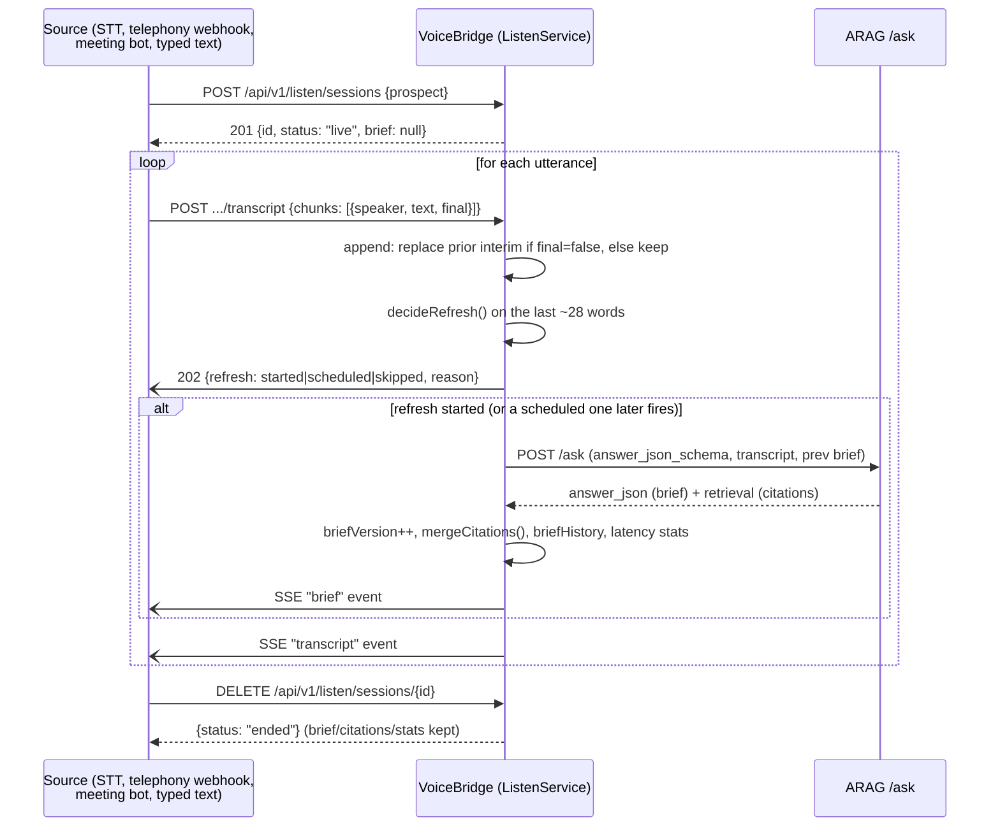
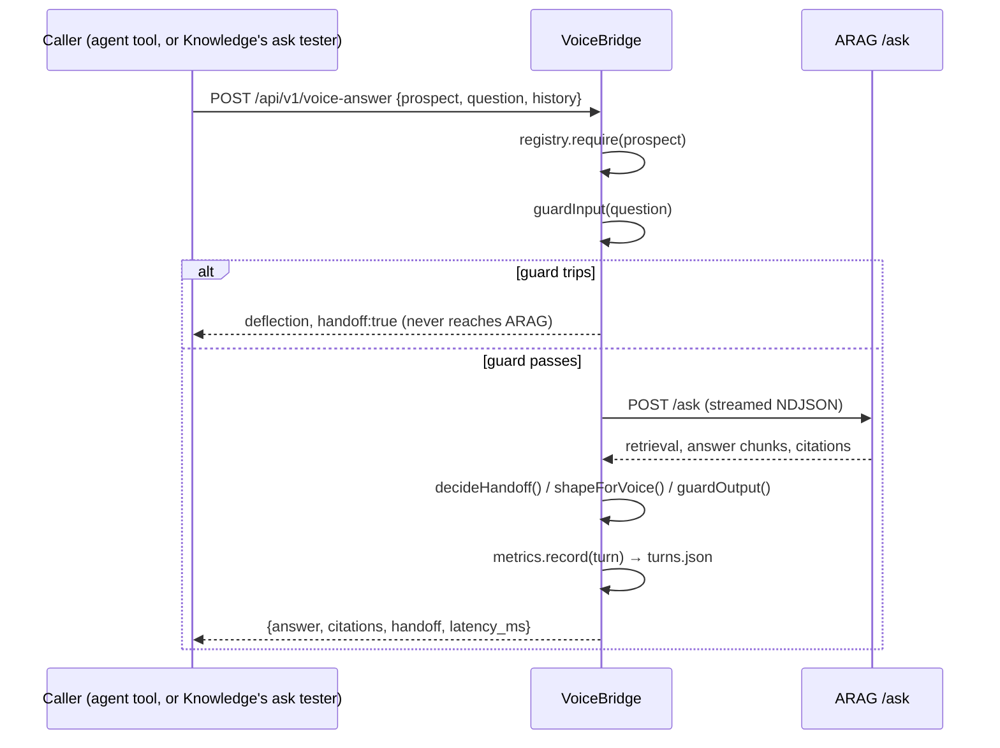
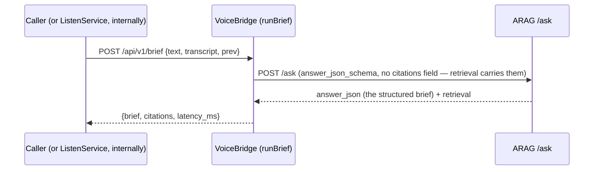
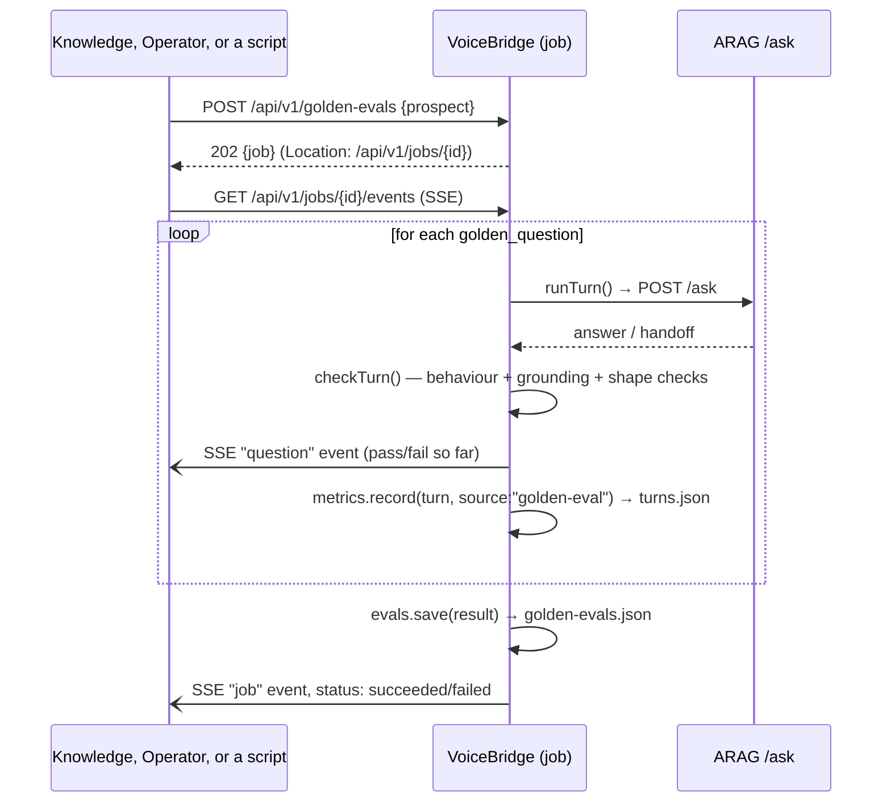

# Data flow

## What is persisted where

Everything VoiceBridge persists lives under `DATA_DIR` (default `./data`, `/data` in the Docker
image and on the Fly volume) as one JSON file per collection, managed by the platform's
`Store`/`Collection` (`vendor/arag-platform/src/store/jsonstore.ts`): an in-memory `Map` backed by
whole-file writes, debounced 50 ms and made atomic with a temp-file rename. There is no database —
see [`../developer/extension-points.md`](../developer/extension-points.md) for how a different
store would slot in behind the same `Collection<T>` interface, and [`scaling.md`](scaling.md) for
when this stops being enough.

| File | Collection | Written by | Read by |
|---|---|---|---|
| `listen-sessions.json` | live and ended listen sessions, capped ring (`cap: 200`, oldest evicted first regardless of status) | `ListenService` (`src/services/listen.ts`) on every session create/append/refresh/end | `GET /api/v1/listen/sessions[/{id}]`, the SSE events stream, `GET /api/v1/admin/listen-sessions` |
| `prospects.json` | registry entries | `ProspectRegistry` (`src/services/registry.ts`) — seeded once from `config/prospects.example.json` on first boot if empty, then admin CRUD | every route that resolves a prospect; the workspace's `/prospects/` view and its prospect switcher (via the non-secret projection) |
| `turns.json` | recent turn log, capped ring (`VOICE_TURN_LOG_LIMIT`, default 500) | `MetricsService.record()` (`src/services/metrics.ts`), called from both the voice-answer route and golden-eval runs | `GET /api/v1/metrics` (aggregated), `GET /api/v1/admin/turns` (raw rows) |
| `jobs.json` | async job records + their event log | `JobManager` (platform, `vendor/arag-platform/src/store/jobs.ts`) | `GET /api/v1/jobs`, `GET /api/v1/jobs/{id}`, the job-events SSE stream |
| `golden-evals.json` | golden-eval results, capped at 50 | `GoldenEvalStore.save()` (`src/services/goldenEval.ts`), called when a golden-eval job finishes | `GET /api/v1/golden-evals/{id}`, `GET /api/v1/admin/golden-evals` |

Nothing else is persisted. Beyond the capped ring above, there is no session store for auth
purposes — the signed, stateless `arag_session`/`arag_admin` cookies (HMAC-signed with
`ADMIN_TOKEN` or a random per-boot secret — see [`security-model.md`](security-model.md)) carry no
server-side state — and no cache. A **listen session** is a different kind of "session" entirely:
not an auth artefact, but the bounded conversation state a live call needs (see below).

## A listen session (the hero path)

**Chunk ingestion and interim-vs-final.** `POST .../transcript` accepts up to 50 chunks per call,
each `{speaker?, text, ts?, final?}` (`final` defaults `true`). Appending a chunk with `final: false`
records it as the current interim hypothesis; the *next* chunk for that session — interim or final —
replaces it rather than accumulating alongside it, so a streaming STT that re-sends its hypothesis
every 200 ms does not fill the transcript with near-duplicates. Only `final` entries are ever
included in the text sent to ARAG (`ListenService.transcriptText()` filters on `t.final`), so a
half-formed interim cannot leak into the grounded brief prompt.

**Throttle decisions.** `decideRefresh()` runs on every append, over the last `windowWords` (28)
words of the transcript: refresh only when there are at least `minWords` (4) words, at least
`minGapMs` (1500 ms) has passed since the last refresh, and the window is not the same
(byte-identical) or too similar (Jaccard similarity > 0.85) to the window that triggered the last
refresh. A `too-soon` decision is not dropped — `ListenService.schedule()` starts a timer that
retries `decideRefresh()` once the gap has elapsed, so a burst of fast speech still gets one
coalesced refresh rather than none.

**Refresh.** A refresh calls the same `runBrief()` primitive `POST /api/v1/brief` exposes, with
`answer_json_schema` set to the `call_brief` schema, the full final transcript, and the session's
*previous* brief so the model refines it rather than restarting (`briefSystemPrompt()` in
`src/services/brief.ts`). `isUsableBrief()` decides whether the result is worth keeping — a failed
or empty refresh increments `stats.failures` and leaves the previous brief exactly as it was, so a
transient ARAG error never blanks what a person is currently reading. A usable refresh bumps
`briefVersion`, appends to `briefHistory` (capped at the most recent 20), merges the new citations
into the running set (`mergeCitations()`, deduped by title+url, best score kept, capped at 12), and
updates the session's latency stats (`lastLatencyMs`, and `p50`/`p95` over the last 50 refreshes).

**SSE fan-out.** `GET .../events` sends the session's current `brief` and `status` immediately on
connect (so a late subscriber is not staring at a blank pane), then streams `transcript`, `brief`
and `status` events as `ListenService.emit()` fires them to every subscriber of that session id — an
in-process `Map<sessionId, Set<listener>>` (`ListenService.listeners`), not a broker, so fan-out only
reaches subscribers connected to the same process (see [`scaling.md`](scaling.md) and
[`limits.md`](limits.md)). Live also polls the session every three seconds as a fallback in
case a brief lands in the gap between opening a session and the stream attaching.

**What is persisted, and its cap.** The whole `ListenSession` — id, prospect, locale, transcript
(capped at the most recent 400 entries / 20,000 characters), brief, `briefVersion`, `briefHistory`
(20), citations (12), stats, and the throttle's internal `lastNorm`/`lastFireAt` — is written to
`DATA_DIR/listen-sessions.json` on every change. The collection itself is capped at 200 documents;
once exceeded, the **oldest by `createdAt`** are evicted regardless of whether they are still
`status: "live"` — in practice this only bites a deployment running many simultaneous long calls
(see [`limits.md`](limits.md)). A session left `status: "live"` by a server restart is marked
`ended` the next time `ListenService` starts (it cannot be refreshed again honestly once the process
that was tracking its throttle state is gone).

**Reviewing a session afterwards.** `briefHistory` is not admin-only: `GET /api/v1/listen/sessions`
and `GET /api/v1/listen/sessions/{id}/export` (which backs the Conversations detail drawer and its
Markdown export) both include it in the public API, so a workspace user can see how the brief
evolved version by version without ever touching Operator. `GET /api/v1/admin/listen-sessions`
returns the equivalent projection for Operator's own Listen sessions view — the same underlying
record, reached from the operator's own navigation. Neither one replays SSE; both read the stored
`briefHistory` directly.

## A voice turn

Only two things reach disk from a turn: the `turns.json` ring entry (question text included only
when the input guard passed — `DECISIONS.md` V-08) and, indirectly, nothing else — the turn itself
is not otherwise recorded, replayed or cached. ARAG is stateless per call, so the full conversation
context relevant to this turn was already in the request (`history`, clamped to
`MAX_HISTORY_TURNS`); VoiceBridge holds no session state across turns beyond what the caller sends
back each time.

## A stateless brief call

`POST /api/v1/brief` is the primitive a listen session calls internally on every refresh (see
above) — it is also callable directly, for an integration that wants one structured brief without
opening a session:

Called directly, nothing from it is persisted server-side — no turn-log entry, no history — and the
caller is responsible for keeping `prev`/`transcript` themselves between calls, exactly the
bookkeeping a listen session does automatically. This is a deliberate difference from the
voice-turn path: the brief is a live copilot aid, not an auditable interaction on its own, so there
is no guard-trip redaction concern and no metrics record — `runBrief()`'s only interaction with
`MetricsService` is none at all. A listen session's use of `runBrief()` inherits this: individual
refreshes are not logged to `turns.json` either, only the session's own aggregate stats.

## A golden-set run

A golden-eval run is deliberately **not** a separate code path from a live turn — it is
`JobManager` (`src/server.ts`'s `GOLDEN_EVAL_JOB` handler) calling `runGoldenEval()`
(`src/services/goldenEval.ts`), which calls the exact same `runTurn()` the voice-answer route uses,
once per golden question, with `conversation_id: "golden-eval"` and no history. Each case's turn is
also recorded into `turns.json` (tagged `source: "golden-eval"`) so the admin turn log and the live
metrics snapshot include golden-eval traffic alongside real turns — useful for seeing latency
trends, but it does mean a golden-set run visibly moves the `turns`/`handoff_rate` numbers in
`GET /api/v1/metrics` (see [`limits.md`](limits.md) for the consequence: the metrics ring has no
concept of excluding synthetic traffic).

`JobManager` persists the job record and its event log to `jobs.json` as it runs, so a client that
disconnects from the SSE stream and reconnects (or polls `GET /api/v1/jobs/{id}` instead) sees the
same progress; the golden-eval result itself is separately persisted to `golden-evals.json` once
the job completes, capped at the 50 most recent runs.
